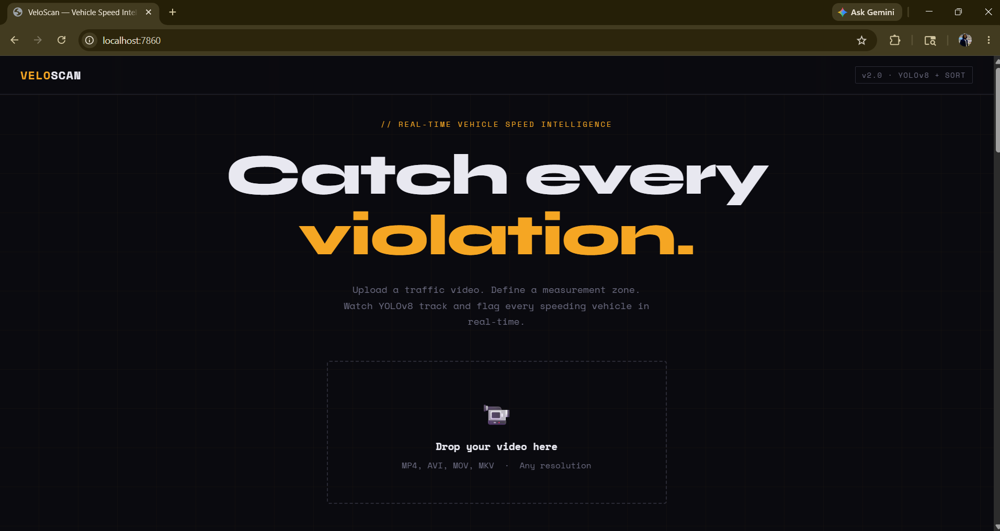
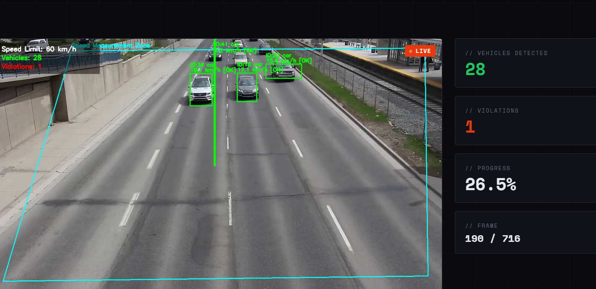

# 🚗 VeloScan — Vehicle Speed Estimator

> Real-time vehicle detection, tracking, and speed estimation from traffic video using YOLOv8 + SORT.

[](https://python.org)
[](https://ultralytics.com)
[](https://fastapi.tiangolo.com)
[](https://opencv.org)

---

## 📸 Screenshots

| Landing Page | Zone Picker |
|---|---|
|  |  |

| Live Detection | Violation Flagged |
|---|---|
|  |  |

---

## 🧭 Project Evolution

This project was built in two versions, each a significant step up from the last.

### V1 — Terminal Pipeline
The first version ran entirely in the terminal. You pointed it at a video file, it opened an OpenCV window, and processed every frame in real time — drawing bounding boxes, track IDs, and speeds directly onto the video. Violations were flagged in red, logged to CSV, and snapshots were saved automatically.

> 📌 **Browse V1 source code:** [Last V1 commit → `e0fc8ba`](https://github.com/M4BareMetal/vehicle-speed-estimator/tree/e0fc8ba)

### V2 — Web Interface *(current)*
V2 wraps the exact same pipeline in a full web application. Upload a video from your browser, click 4 points to define your measurement zone on the first frame, set your speed limit, and watch it process live — frames stream back to the browser in real time with all annotations. Results page shows violation count, per-vehicle snapshots, and stats.

**V1 core code is 100% untouched in V2.** The web layer just wraps it.

---

## ✨ Features

- 🎯 Real-time vehicle detection using YOLOv8n
- 🔁 Multi-object tracking with SORT (Kalman Filter + Hungarian Algorithm)
- 📐 Perspective transform to convert pixel motion into real-world km/h
- ⚠️ Overspeed detection with configurable speed limit
- 📸 Automatic violation snapshots saved per frame
- 📊 CSV log of every vehicle observation
- 🌐 Web UI with live frame streaming via Server-Sent Events
- 🖱️ Interactive zone picker — click 4 points on the first frame in browser

---

## 🛠️ Tech Stack

| Layer | Technology |
|---|---|
| Detection | YOLOv8n (Ultralytics) |
| Tracking | SORT — Kalman Filter + Hungarian Algorithm |
| Speed Estimation | OpenCV Perspective Transform |
| Alert Engine | Configurable speed threshold |
| Backend (V2) | FastAPI + Server-Sent Events |
| Frontend (V2) | Vanilla JS + HTML5 Canvas |
| Config | YAML-based, single file controls everything |

---

## 📁 Project Structure

```
vehicle_speed_estimator/
├── main.py                  # V1 — terminal pipeline entry point
├── app.py                   # V2 — FastAPI web server entry point
├── config.yaml              # Central config for all modules
├── requirements.txt
│
├── api/                     # V2 web layer
│   ├── routes.py            # Upload, process, health endpoints
│   └── processing.py        # Pipeline runner + SSE frame streamer
│
├── static/
│   └── index.html           # V2 full web UI (single file)
│
├── core/                    # Shared by V1 and V2 — untouched
│   ├── video_stream.py      # Frame ingestion + FPS handling
│   ├── detector.py          # YOLOv8 vehicle detection
│   ├── tracker.py           # SORT multi-object tracking
│   ├── speed_estimator.py   # Perspective transform + speed calc
│   ├── alert_engine.py      # Overspeed detection logic
│   └── reporter.py          # CSV logs + violation snapshots
│
├── utils/
│   ├── drawing.py           # Frame annotation helpers
│   ├── calibration.py       # Perspective transform utilities
│   └── zone_picker.py       # V1 interactive zone calibration tool
│
├── ui/
│   └── dashboard.py         # Streamlit analytics dashboard (V1)
│
├── assets/                  # Screenshots for README
└── tests/
    ├── test_calibration.py
    └── test_alert_engine.py
```

---

## ⚙️ How It Works

```
Camera / Video File
       ↓
  VehicleDetector      →  YOLOv8 bounding boxes per frame
       ↓
  VehicleTracker       →  SORT assigns stable IDs across frames
       ↓
  SpeedEstimator       →  Perspective transform → real-world km/h
       ↓
  AlertEngine          →  Flags vehicles exceeding speed limit
       ↓
  ReportManager        →  CSV log + violation frame snapshots
       ↓
  Web UI / Terminal    →  Annotated live video output
```

---

## 🚀 Setup & Running

### 1. Clone & Install

```bash
git clone https://github.com/M4BareMetal/vehicle-speed-estimator.git
cd vehicle-speed-estimator
pip install -r requirements.txt
```

### 2. Run V2 — Web Interface *(recommended)*

```bash
python app.py
```

Open your browser at `http://localhost:7860`

**Flow:**
1. Upload a traffic video
2. Click 4 points on the road to define your measurement zone
3. Set your speed limit
4. Hit Analyze — watch it run live
5. Review violations and stats on the results page

### 3. Run V1 — Terminal Pipeline

```bash
# First calibrate your zone
python utils/zone_picker.py

# Then run
python main.py
```

Press `Q` to quit. Results saved to `output/vehicle_log.csv`.

---

## 🔧 Configuration

Everything lives in `config.yaml`:

```yaml
source:
  type: video            # "video" or "webcam"
  path: data/sample.mp4

model:
  yolo_model: yolov8n.pt
  confidence_threshold: 0.35
  classes: [2, 3, 5, 7]  # car, motorcycle, bus, truck

speed:
  speed_limit_kmh: 60
  measurement_zone: [[x1,y1], [x2,y2], [x3,y3], [x4,y4]]
  real_world_zone_meters: [[0,0], [12,0], [12,25], [0,25]]

tracking:
  max_age: 20
  min_hits: 3
  iou_threshold: 0.3
```

---

## 📤 Outputs

| Output | Description |
|---|---|
| `output/vehicle_log.csv` | Per-frame record of every tracked vehicle and its speed |
| `output/violations/` | JPG snapshots of every frame where a vehicle exceeded the limit |

---

## 🧪 Tests

```bash
python tests/test_calibration.py
python tests/test_alert_engine.py
```

---

## 🔭 Future Extensions

- Edge deployment on Raspberry Pi or NVIDIA Jetson
- Multi-camera support
- License plate recognition integration
- REST API for sending violations to a central server
- Real-time alerts via SMS / email


---
## 🖥️ Live Demo

**[🚀 Click here to try VeloScan live →](https://m4baremetal-vehicle-speed-estimator.hf.space)**


## 🎥 V3 — Live Camera Detection

**What's new:** Real-time webcam support. No video file needed.

- Click **"Use Live Camera"** on the landing page
- Browser requests camera permission
- First frame appears — pick your 4-point measurement zone
- Detection starts instantly via WebSocket streaming
- Same YOLOv8 + SORT pipeline, now running on live frames at ~15fps

> **Testing tip:** Point your laptop camera at a traffic video playing on your phone for an instant demo.